# Final Data-Flow Diagram

## End-to-End Data Flow

Group Eta's production pipeline integrates three approved data sources through RAW, STAGING, CURATED, and PostgreSQL layers.

```mermaid
flowchart LR

    %% =========================================================
    %% EXTERNAL SOURCES
    %% =========================================================

    A["WRI<br/>Global Power Plant Database"]
    B["OWID<br/>CO2 and GHG Data"]
    C["World Bank<br/>Indicators API"]

    %% =========================================================
    %% INGESTION
    %% =========================================================

    D["Automated Source Ingestion<br/>src/extract/"]

    %% =========================================================
    %% RAW LAYER
    %% =========================================================

    E1["RAW<br/>WRI"]
    E2["RAW<br/>OWID"]
    E3["RAW<br/>World Bank"]

    F["Raw Validation<br/>src/validate/raw_validation.py"]

    %% =========================================================
    %% STAGING TRANSFORMATIONS
    %% =========================================================

    G1["WRI Cleaning<br/>clean_powerplants.py"]
    G2["OWID Cleaning<br/>clean_owid.py"]
    G3["World Bank Cleaning<br/>clean_world_bank.py"]

    H1["STAGING<br/>Power Plants"]
    H2["STAGING<br/>OWID 2019"]
    H3["STAGING<br/>World Bank 2019"]

    I["Staging Validation"]

    %% =========================================================
    %% FEATURE ENGINEERING + INTEGRATION
    %% =========================================================

    J["Installed-Capacity<br/>Feature Engineering"]

    K["Three-Source<br/>Integration"]

    %% =========================================================
    %% CURATED LAYER
    %% =========================================================

    L["CURATED<br/>eta_curated_2019.parquet<br/>34,936 Plant Rows"]

    M["Curated Validation"]

    %% =========================================================
    %% STORAGE
    %% =========================================================

    N["PostgreSQL<br/>Normalization + Load"]

    O["7 Normalized<br/>Relational Tables"]

    %% =========================================================
    %% DOWNSTREAM USE
    %% =========================================================

    P["Representative<br/>SQL Queries"]

    Q["Philippines<br/>Context Analysis"]

    R["Partitioned Parquet<br/>and File-Format Outputs"]


    %% =========================================================
    %% FLOW
    %% =========================================================

    A --> D
    B --> D
    C --> D

    D --> E1
    D --> E2
    D --> E3

    E1 --> F
    E2 --> F
    E3 --> F

    F --> G1
    F --> G2
    F --> G3

    G1 --> H1
    G2 --> H2
    G3 --> H3

    H1 --> I
    H2 --> I
    H3 --> I

    H1 --> J

    J --> K
    H2 --> K
    H3 --> K

    K --> L

    L --> M

    M --> N

    N --> O

    O --> P
    O --> Q

    L --> R
```



---

## Production Pipeline Sequence

At the highest level, the project follows:

```text
External Sources
        ↓
Automated Ingestion
        ↓
RAW
        ↓
Raw Validation
        ↓
Source-Specific Cleaning
        ↓
STAGING
        ↓
Staging Validation
        ↓
Installed-Capacity Feature Engineering
        +
OWID 2019 Staging
        +
World Bank 2019 Staging
        ↓
Three-Source Integration
        ↓
CURATED
        ↓
Curated Validation
        ↓
PostgreSQL Normalization + Load
        ↓
SQL Retrieval and Analysis
```

---

## 1. External Data Sources

The pipeline uses three approved external sources:

### WRI Global Power Plant Database

Provides plant-level information, including:

- plant identifiers
- plant names
- countries
- installed capacity
- primary fuel
- geographic coordinates
- generation-related fields where available

### Our World in Data

Provides country-level carbon-emissions and greenhouse-gas indicators.

The project uses a 2019 country-level snapshot for integration.

### World Bank Indicators

Provides country-level economic and demographic indicators.

The project uses 2019 values for:

- GDP, current US$
- population
- GDP per capita, current US$

---

## 2. Automated Ingestion

Source extraction is implemented under:

`src/extract/`

The ingestion layer retrieves source data and writes source-faithful files into:

`data/raw/`

The three source datasets remain separate during ingestion.

---

## 3. RAW Layer

The RAW layer preserves retrieved source data as closely as practical to the original source representation.

The project maintains separate raw inputs for:

- WRI
- OWID
- World Bank

Analytical joins are not performed in the RAW layer.

---

## 4. Raw Validation

Raw data are checked before transformation.

Validation includes checks such as:

- required columns
- expected structure
- missing values
- duplicate records
- data types
- accepted values
- numerical ranges
- source-specific integrity rules

Validation failures are designed to be visible through tests, reports, logs, or task failures.

---

## 5. STAGING Transformations

Each source is transformed independently before integration.

### WRI

`src/transform/clean_powerplants.py`

Produces a cleaned plant-level staging dataset.

Major operations include:

- ISO-3 country-code standardization
- string cleaning
- numeric conversion
- required-field handling
- positive-capacity filtering
- plant-grain preservation

### OWID

`src/transform/clean_owid.py`

Produces the 2019 country-level OWID staging dataset.

Major operations include:

- valid ISO-3 filtering
- 2019 snapshot filtering
- numeric conversion
- country-name standardization
- removal of OWID GDP and population fields that overlap with the World Bank source

### World Bank

`src/transform/clean_world_bank.py`

Combines the selected World Bank indicators into one 2019 country-level staging dataset.

The selected indicators are:

- GDP
- population
- GDP per capita

---

## 6. Staging Validation

The three staging datasets are validated before curated integration.

Validation checks include:

- schema correctness
- data types
- nullability
- uniqueness
- duplicate detection
- ISO-code validity
- numerical ranges
- row-count sanity
- Philippine-record preservation

---

## 7. Installed-Capacity Feature Engineering

Installed-capacity features are derived from the staged WRI power-plant records.

Examples include:

- total installed capacity by country
- installed capacity by primary fuel
- primary-fuel capacity share
- fossil installed capacity
- renewable installed capacity
- fossil share
- renewable share

These features are temporarily calculated at country or country-fuel grain and are then attached back to individual plant records.

This process does not change the final plant-level analytical grain.

---

## 8. Three-Source Integration

The curated integration combines:

```text
WRI plant records
+
installed-capacity features
+
OWID 2019 indicators
+
World Bank 2019 indicators
```

The main integration key is the ISO-3 country code.

WRI remains the base plant-level dataset.

Country-level records are attached using many-to-one relationships.

Left joins are used so legitimate power plants are preserved even when one of the country-level sources does not contain a matching record.

---

## 9. CURATED Layer

The final analytical dataset is:

`data/curated/eta_curated_2019.parquet`

Its natural grain is:

**ONE ROW = ONE REAL POWER PLANT**

Validated characteristics include:

- 34,936 plant rows
- 34,936 unique plant IDs
- 167 countries
- 123 Philippine plant records

The curated dataset contains plant attributes, installed-capacity features, OWID indicators, World Bank indicators, and source-match flags.

---

## 10. Curated Validation

The curated dataset is validated after integration.

Checks include:

- plant-grain preservation
- unique plant identifiers
- country-code integrity
- source-match consistency
- capacity-share ranges
- Philippines preservation
- expected row counts
- integration consistency

The production curated output reproduces the validated characteristics of the reference prototype.

---

## 11. PostgreSQL Normalization and Loading

The wide curated dataset is converted into a normalized relational representation.

The PostgreSQL database contains seven tables:

1. `countries`
2. `fuel_types`
3. `power_plants`
4. `plant_generation`
5. `country_emissions`
6. `country_economic_indicators`
7. `country_fuel_capacity`

The PostgreSQL layer provides:

- primary-key enforcement
- foreign-key relationships
- reduced repetition of country-level information
- structured relational storage
- SQL-based retrieval and analysis

---

## 12. PostgreSQL Row Counts

The validated PostgreSQL load contains:

| Table | Rows |
|---|---:|
| `countries` | 167 |
| `fuel_types` | 15 |
| `power_plants` | 34,936 |
| `plant_generation` | 193,976 |
| `country_emissions` | 164 |
| `country_economic_indicators` | 162 |
| `country_fuel_capacity` | 698 |

The loading process was executed repeatedly with unchanged row counts, demonstrating idempotent UPSERT behavior.

---

## 13. Downstream Outputs

### Representative SQL Queries

PostgreSQL supports retrieval of:

- plant information
- installed capacity by fuel
- country-level emissions
- economic indicators
- capacity rankings
- relationship-integrity checks

### Philippines Context Analysis

The normalized database is used to produce a focused Philippine analysis of:

- plant count
- installed capacity
- fuel mix
- fossil and renewable capacity shares
- emissions context
- economic and demographic indicators
- major Philippine power plants

### Partitioning and File Formats

The curated analytical dataset can also be used for:

- partitioned Parquet outputs
- selective partition reads
- CSV / JSON / Parquet comparisons

These outputs serve analytical and data-engineering use cases separate from the normalized PostgreSQL representation.

---

## 14. Airflow Orchestration

The intended Airflow execution sequence is:

```text
start
  ↓
extract_all
  ↓
validate_raw
  ↓
transform_staging
  ↓
validate_staging
  ↓
transform_curated
  ↓
validate_curated
  ↓
load_postgres
  ↓
end
```

The production entrypoints available for Sophia's transformation and loading stages are:

```bash
python -m src.transform.run_staging
python -m src.transform.run_curated
python -m src.load.postgres_data_loader
```

Final task wiring and successful full-DAG execution are verified during the final orchestration integration stage.

---

## 15. Data-Grain Summary

The pipeline intentionally works with different grains at different stages.

| Dataset | Grain |
|---|---|
| WRI staging | One row per power plant |
| OWID staging | One row per country for 2019 |
| World Bank staging | One row per country for 2019 |
| Capacity features | Country or country-fuel aggregation |
| Curated dataset | One row per power plant |
| PostgreSQL `power_plants` | One row per power plant |
| PostgreSQL `plant_generation` | One row per plant per year |
| PostgreSQL emissions | One row per country per year |
| PostgreSQL economic indicators | One row per country per year |
| PostgreSQL fuel capacity | One row per country, fuel, and snapshot year |

---

## Reproducibility Principle

The production pipeline does not depend on the manually prepared reference CSV.

Instead, the final analytical dataset is recreated from approved source data through:

```text
Ingestion
→ Validation
→ Transformation
→ Integration
→ Curated Validation
→ PostgreSQL Loading
```

The reference notebook and historical merged output are used only as regression references for validating the behavior of the production pipeline.