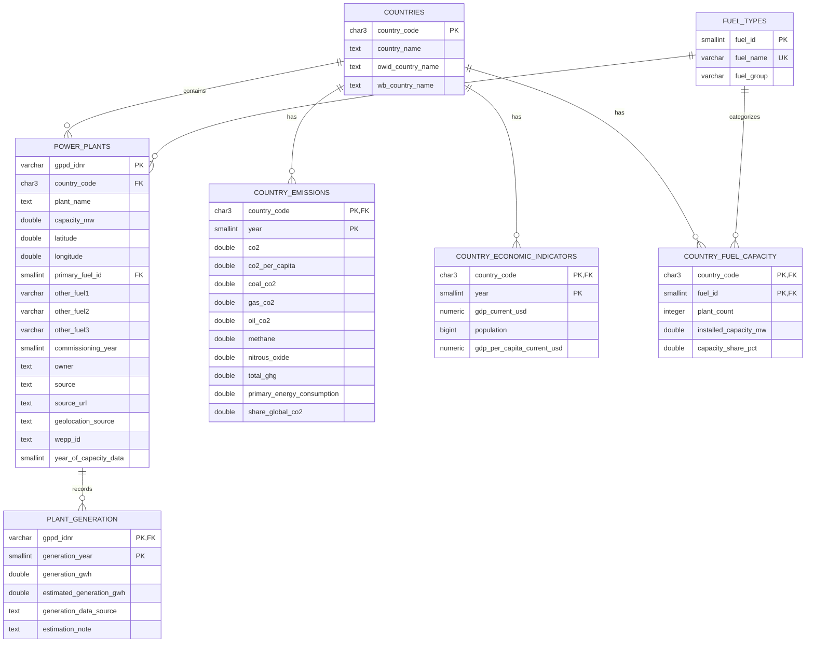

# Preliminary Entity-Relationship Diagram

## Purpose

This document presents the preliminary Entity-Relationship Diagram (ERD) for the Group Eta data engineering project.

The model is based on the current three-source integration design involving:

- Global Power Plant Database (WRI)
- Our World in Data (OWID) CO₂ dataset
- World Bank Indicators API

The ERD is preliminary and is intended to guide the later PostgreSQL implementation.

The final database structure may be refined after the modular transformation pipeline and PostgreSQL loading components are completed.

---

## Preliminary ERD

---

## Relationship Summary

### Countries to Power Plants

Relationship:

**One country → many power plants**

A country may contain multiple power plants, while each power plant belongs to one country.

Foreign key:

`power_plants.country_code` → `countries.country_code`

---

### Fuel Types to Power Plants

Relationship:

**One fuel type → many power plants**

A standardized fuel type may classify many power plants.

Foreign key:

`power_plants.primary_fuel_id` → `fuel_types.fuel_id`

---

### Power Plants to Plant Generation

Relationship:

**One power plant → many yearly generation observations**

A power plant may have generation records for multiple years.

Foreign key:

`plant_generation.gppd_idnr` → `power_plants.gppd_idnr`

The proposed composite primary key is:

`gppd_idnr + generation_year`

---

### Countries to Country Emissions

Relationship:

**One country → many yearly emissions records**

OWID emissions indicators are stored at country-year grain.

Foreign key:

`country_emissions.country_code` → `countries.country_code`

The proposed composite primary key is:

`country_code + year`

---

### Countries to Economic Indicators

Relationship:

**One country → many yearly economic/demographic records**

World Bank indicators are stored at country-year grain.

Foreign key:

`country_economic_indicators.country_code` → `countries.country_code`

The proposed composite primary key is:

`country_code + year`

---

### Countries and Fuel Types through Country Fuel Capacity

`country_fuel_capacity` acts as an analytical bridge between countries and standardized fuel categories.

Relationship:

**One country → many country-fuel capacity records**

and

**One fuel type → many country-fuel capacity records**

The proposed composite primary key is:

`country_code + fuel_id`

The table stores derived installed-capacity characteristics such as:

- Number of plants
- Installed capacity
- National capacity share

---

## Data Grain by Entity

| Entity | Proposed Grain |
|---|---|
| `countries` | One row per ISO-3 country |
| `fuel_types` | One row per standardized fuel type |
| `power_plants` | One row per real power plant |
| `plant_generation` | One row per plant per year |
| `country_emissions` | One row per country per year |
| `country_economic_indicators` | One row per country per year |
| `country_fuel_capacity` | One row per country per fuel type |

---

## Source-to-Entity Mapping

### WRI Global Power Plant Database

Primarily contributes to:

- `power_plants`
- `plant_generation`
- `countries`
- `fuel_types`
- derived `country_fuel_capacity`

### Our World in Data

Primarily contributes to:

- `country_emissions`
- supporting country-name information in `countries`

### World Bank Indicators API

Primarily contributes to:

- `country_economic_indicators`
- supporting country-name information in `countries`

---

## Wide Analytical Dataset vs. Relational Database

The current integrated analytical dataset remains plant-level and contains repeated country-level information for convenience.

That wide analytical representation is useful for:

- Data analysis
- Visualization
- Modeling
- Export
- Regression comparison with the reference prototype

The PostgreSQL database is proposed to use a more normalized relational design to reduce unnecessary repetition and improve data integrity.

Therefore, the project may maintain both:

**Curated wide analytical dataset**

and

**Normalized PostgreSQL relational tables**

These serve different purposes and are not considered contradictory designs.

---

## Current Modeling Assumptions

The preliminary ERD assumes that:

1. `gppd_idnr` remains unique for real power plants.
2. ISO-3 country codes provide the principal country integration key.
3. OWID country indicators can be represented at country-year grain.
4. World Bank indicators can be represented at country-year grain.
5. Plant generation measurements are better represented vertically by year rather than as separate year-specific columns.
6. Fuel categories can be standardized sufficiently to support a fuel lookup table.
7. Country fuel-capacity values are derived analytical features rather than raw source records.
8. The 2019 project snapshot can later be extended to other years without redesigning the country-year tables.

---

## Future Refinements

During later PostgreSQL implementation, the following will be finalized:

- Exact PostgreSQL data types
- Sequence or identity behavior
- Nullability constraints
- CHECK constraints
- UNIQUE constraints
- Indexes
- Cascading rules
- Loading order
- Data-loading interfaces
- Performance considerations
- Final ERD
- Representative SQL queries

The final schema should be validated against the completed transformation pipeline before implementation is considered complete.